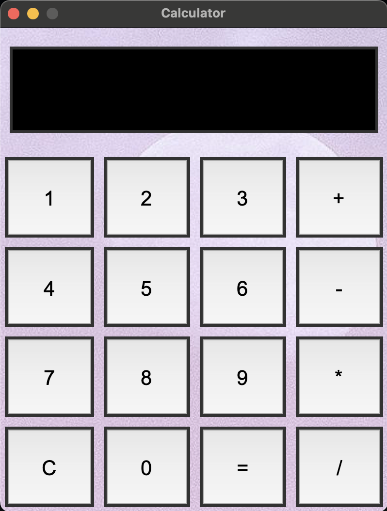

# Python Calculator

A visually appealing calculator app built with Tkinter.

## Features

- Basic arithmetic operations: +, -, \*, /
- Clear (C) button to reset the display
- Backspace (DEL) button to delete the last character
- Responsive, modern UI with background image
- Large, easy-to-read buttons and display
- Keyboard input disabled for display box (use buttons only)

## How to Run

1. Make sure you have Python 3 installed.
2. Place your background image (PNG) in the `python_calculator` folder.
3. Run the calculator:
   ```bash
   python calculator.py
   ```

## Customization

- Change the background image by replacing `pexels-eberhardgross-2310713.png`.
- Adjust window size and fonts in `calculator.py` for your preference.

## Screenshot



---

Made with ❤️ using Tkinter.
